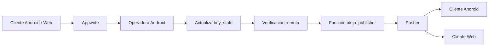

# TallerAlejo

<p align="center">
  
  
  
  
  
</p>

<p align="center">
  <strong>Suite operativa para ventas, reservas y flujo de confirmacion de Taller Alejo.</strong><br/>
  Un mismo producto, multiples roles, una sola estrategia tecnica: persistencia local, sincronizacion remota y eventos en tiempo real.
</p>

---

## Vision

**TallerAlejo** es un monorepo que concentra las aplicaciones cliente y operativas del negocio:

- una aplicacion Android para cliente final
- una aplicacion Android para operador de escaneo y confirmacion
- una aplicacion web para cliente
- una function ligera para publicar eventos realtime sin exponer secretos en frontend

El objetivo del producto es claro:

- permitir compras y reservaciones con experiencia consistente
- soportar operacion con conectividad inestable
- sincronizar con Appwrite como fuente remota
- propagar cambios relevantes por Pusher en tiempo real

Este repositorio representa un **MVP serio**, ya con decisiones de arquitectura, separacion por capas, modulos compartidos y una estrategia clara de evolucion hacia cores posteriores.

---

## Tabla De Contenidos

- [Navegacion Del Repositorio](#navegacion-del-repositorio)
- [Panorama Del Monorepo](#panorama-del-monorepo)
- [Aplicaciones Incluidas](#aplicaciones-incluidas)
- [Arquitectura](#arquitectura)
- [Stack Tecnico](#stack-tecnico)
- [Patrones Y Tecnicas Programaticas](#patrones-y-tecnicas-programaticas)
- [Sincronizacion Y Realtime](#sincronizacion-y-realtime)
- [Fortalezas Del MVP](#fortalezas-del-mvp)
- [Deuda Tecnica Conocida](#deuda-tecnica-conocida)
- [Roadmap Por Cores](#roadmap-por-cores)
- [Estructura Del Repositorio](#estructura-del-repositorio)
- [Puesta En Marcha](#puesta-en-marcha)
- [Criterio De Calidad](#criterio-de-calidad)

---

## Navegacion Del Repositorio

### README principales por superficie

- [Android Cliente](./app/README.md)
- [Android Operador](./alejotallerscan/README.md)
- [Web Cliente](./web/README.md)
- [Function Publisher](./function/alejo_publisher/README.md)

### Cuando leer cada uno

- usa este README para entender la vision general, arquitectura y roadmap del producto
- usa los README especificos para despliegue, configuracion y detalles operativos de cada superficie

---

## Panorama Del Monorepo

```text
TallerAlejo/
|- app/                 -> Android cliente
|- alejotallerscan/     -> Android operador
|- web/                 -> Cliente web
|- function/
|  \- alejo_publisher/  -> Servicio HTTP para publicar eventos a Pusher
|- shared-auth/         -> Autenticacion compartida
|- shared-core/         -> Reglas y utilidades transversales
|- shared-data/         -> Data layer compartida, mappers, DTOs, repositorios
|- shared-sale/         -> Dominio de ventas compartido
|- mapper-processor/    -> Procesamiento auxiliar
```

La idea central del repositorio es evitar duplicacion de logica critica entre clientes y mantener las reglas de negocio sensibles dentro de modulos compartidos.

---

## Aplicaciones Incluidas

### `app`
Aplicacion Android orientada al cliente final.

Responsabilidades principales:

- autenticacion y sesion de usuario
- consulta de catalogo
- compra o reservacion
- persistencia local para operacion offline
- recepcion de eventos realtime de verificacion de venta

### `alejotallerscan`
Aplicacion Android para operadores.

Responsabilidades principales:

- escaneo QR moderno
- carga manual de reservaciones
- verificacion o rechazo de ventas
- historial local interno del operador
- sincronizacion de pendientes locales
- notificaciones locales cuando otra operadora ya proceso una reserva

### `web`
Aplicacion cliente web.

Responsabilidades principales:

- onboarding y experiencia comercial web
- compra o reservacion desde navegador
- persistencia offline en IndexedDB
- suscripcion a eventos realtime por Pusher
- descarga guiada de APK desde releases

### `function/alejo_publisher`
Servicio HTTP minimo para publicar eventos a Pusher desde infraestructura controlada.

Responsabilidades principales:

- recibir payload validado desde la app operadora
- publicar `sale:confirmed` y `sale:rejected` al canal esperado
- aislar secretos de Pusher del frontend
- evitar problemas de firma por timestamp desde cliente movil

---

## Arquitectura

### Enfoque general

El repositorio sigue una arquitectura **modular, por feature y por capas**:

- `data`
- `domain`
- `presentation`

Cada feature implementa el mismo lenguaje arquitectonico, tanto en Android como en la capa web equivalente.

### Forma de trabajo por feature

```text
feature/{feature}/
|- data/
|  |- dao/
|  |- dto/
|  |- mapper/
|  \- repository/
|- domain/
|  |- caseuse/
|  |- entity/
|  \- repository/
|- presentation/
|  |- model/
|  |- screen/
|  \- viewmodel/
\- di/
```

### Principio rector

La fuente de verdad no es solamente la nube.  
El sistema opera con una mentalidad **offline-first con reconciliacion**:

- guarda local primero cuando el flujo lo requiere
- sincroniza con Appwrite cuando la conectividad lo permite
- conserva la coherencia mediante repositorios especializados
- consume realtime para reducir latencia perceptiva entre actores

---

## Stack Tecnico

### Android

- Kotlin
- Jetpack Compose
- Material 3
- Koin
- Room
- Coroutines
- StateFlow
- CameraX
- ML Kit Barcode Scanning
- Appwrite Kotlin SDK
- OkHttp

### Web

- Svelte
- Vite
- TypeScript
- Dexie
- Appwrite Web SDK
- Pusher JS
- M3 Svelte

### Infraestructura Y Servicios

- Appwrite
- Pusher
- Render
- GitHub Releases

---

## Patrones Y Tecnicas Programaticas

### 1. Offline-First Reconciliation

Se prioriza persistencia local y posterior reconciliacion remota.  
Esto permite:

- operar sin depender de red estable
- recuperar pendientes locales
- reintentar pushes remotos
- fusionar remoto y local sin perder contexto del usuario

### 2. Repository Pattern

Los repositorios separan claramente:

- acceso local
- acceso remoto
- reglas de sincronizacion
- traduccion entre DTOs y entidades de dominio

### 3. Use Case Per Action

La logica del negocio no se concentra en UI ni en repositorios gigantes.  
Cada accion importante se encapsula en casos de uso concretos.

Ejemplos del dominio:

- autenticar usuario
- registrar nueva venta
- interpretar evento realtime
- sincronizar pendientes del operador
- enriquecer productos tras escaneo QR

### 4. Immutable UI State

Los ViewModels exponen `StateFlow` inmutable y manejan estados de UI explicitamente:

- loading
- selected item
- error
- notice
- sync status

Esto reduce acoplamiento visual y hace mas predecible la UI.

### 5. Shared Domain Modules

Buena parte de la logica critica no vive duplicada por app.  
Los modulos `shared-*` concentran:

- entidades de negocio
- autenticacion compartida
- contratos de repositorio
- mappers y repositorios de soporte
- casos de uso reutilizables

### 6. Event-Driven Feedback

La verificacion de ventas no depende solo de polling.

Se utiliza una estrategia dirigida por eventos:

- Appwrite persiste el cambio
- la operadora verifica el estado remoto
- la function publica a Pusher
- cliente Android y web reaccionan al evento

---

## Sincronizacion Y Realtime

### Flujo resumido de una venta



### Decisiones tecnicas relevantes

- la operadora ya no firma directamente contra Pusher
- la function `alejo_publisher` se encarga de publicar
- el flujo no continua si Appwrite no confirma el cambio esperado
- el historial interno del operador se conserva localmente

### Beneficio de esta decision

- menos fragilidad por reloj del dispositivo
- secretos de Pusher fuera del APK
- flujo mas auditable
- mejor base para endurecimiento posterior

---

## Fortalezas Del MVP

### Base arquitectonica consistente

La mayor fortaleza del proyecto es que ya existe una estructura tecnica coherente y reutilizable, no un conjunto de pantallas aisladas.

### Multiplataforma con dominio compartido

La coexistencia de Android cliente, Android operador y web cliente sobre modulos compartidos reduce divergencias funcionales.

### Operacion real con conectividad imperfecta

El producto no depende ingenuamente de conectividad perfecta.  
Tiene persistencia local, sync y manejo de pendientes como parte del diseño, no como agregado tardio.

### Flujo operativo completo

El rol operador ya resuelve un problema real de negocio:

- captura
- validacion
- confirmacion
- rechazo
- historial
- sincronizacion de pendientes

### Evolucion ordenada

El monorepo ya tiene forma de plataforma:

- apps
- modulos compartidos
- servicio auxiliar
- pipeline de releases descargables

---

## Deuda Tecnica Conocida

Estas deudas no invalidan el MVP, pero deben considerarse para una fase posterior:

- la seguridad del `publisher` aun usa una API key simple de MVP
- Appwrite sigue siendo accedido desde clientes en varias operaciones sensibles
- el esquema remoto arrastra decisiones de modelado mejorables como `products` serializado como string
- falta endurecer mejor politicas de conflicto y reconciliacion para todos los features
- todavia hay espacio para mas homogeneidad visual entre todas las superficies
- la cobertura automatizada aun no es uniforme en todas las capas y apps
- hay flows donde conviene mover mas logica sensible a backend o functions

---

## Roadmap Por Cores

### Core MVP

Objetivo:

- estabilizar compra, reserva, verificacion y realtime
- cerrar consistencia entre Android, web y operadora
- asegurar deploys y releases trazables

### Core V2

Objetivo:

- endurecer seguridad y backends auxiliares
- reducir responsabilidad sensible en frontend

Pendientes naturales:

- auth mas robusta entre apps y roles
- API key temporal o firma mejorada para functions
- mas operaciones mediadas por backend
- mejoras de observabilidad y monitoreo

### Core V3

Objetivo:

- escalar operacion y analitica

Pendientes naturales:

- dashboards mas avanzados
- reportes y metricas de negocio
- auditoria operativa mas completa
- mayor automatizacion de conciliacion y alertas

---

## Estructura Del Repositorio

```text
.
|- app/
|- alejotallerscan/
|- web/
|- function/
|  \- alejo_publisher/
|- shared-auth/
|- shared-core/
|- shared-data/
|- shared-sale/
|- mapper-processor/
|- build.gradle.kts
|- settings.gradle.kts
\- local.properties
```

### Modulos compartidos

- `shared-auth`: autenticacion, roles, acceso de operador
- `shared-core`: piezas transversales y reglas comunmente reutilizadas
- `shared-data`: DTOs, mappers, repositorios y soporte de persistencia/sync
- `shared-sale`: dominio de venta, estados, entidades y casos de uso

---

## Puesta En Marcha

### Android

```bash
./gradlew assembleDebug
```

### Compilacion de modulo operador

```bash
./gradlew :alejotallerscan:compileDebugKotlin
```

### Web

```bash
cd web
pnpm install
pnpm dev
```

### Function local

```bash
cd function/alejo_publisher
npm install
npm run dev
```

### Configuracion esperada

El repositorio utiliza variables o propiedades para:

- Appwrite endpoint y project id
- credenciales de Pusher
- URL del publisher
- URLs de releases APK
- claves de Telegram

En Android parte de esta configuracion se inyecta desde `local.properties` hacia `BuildConfig`.

---

## Criterio De Calidad

El repositorio se considera sano cuando conserva estas propiedades:

- compilacion estable por modulo
- reglas de dominio compartidas entre superficies
- sincronizacion local/remota verificable
- realtime alineado entre emisor y suscriptores
- pantallas resilientes a contenido largo y estados de red

### Señales de madurez ya presentes

- estructura por feature clara
- separacion de responsabilidades
- modulos compartidos reales
- test unitarios en modulos clave
- flows criticos ya instrumentados con logs y verificacion de estado remoto

---

## Estado Actual Del Proyecto

**TallerAlejo no es un prototipo visual suelto.**  
Es un MVP funcional con base arquitectonica seria, pensado para seguir creciendo por iteraciones sin rehacerse desde cero.

El foco actual del repositorio es:

- consolidar la estabilidad del flujo comercial
- mantener coherencia entre plataformas
- endurecer progresivamente los tramos sensibles

---

## Licencia Y Uso

Repositorio privado de trabajo para el ecosistema **TallerAlejo**.  
Su estructura, modulos y despliegues responden al producto y a sus necesidades operativas reales.
